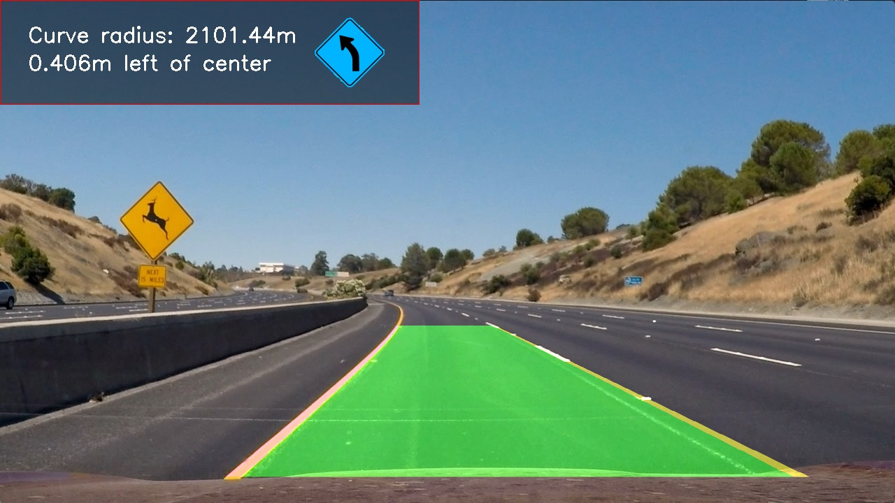

## Advanced Lane Finding - Hung Lam


The goals / steps of this project are the following:

* Compute the camera calibration matrix and distortion coefficients given a set of chessboard images.
* Apply a distortion correction to raw images.
* Use color transforms, gradients, etc., to create a thresholded binary image.
* Apply a perspective transform to rectify binary image ("birds-eye view").
* Detect lane pixels and fit to find the lane boundary.
* Determine the curvature of the lane and vehicle position with respect to center.
* Warp the detected lane boundaries back onto the original image.
* Output visual display of the lane boundaries and numerical estimation of lane curvature and vehicle position.


[//]: # (Image References)
[image0]: ./output_images/output_image7.jpg "Calibration"
[image1]: ./output_images/undistorted_imagex0.jpg "Undistorted"
[image1a]: ./output_images/undistorted_imagex1.jpg "Undistorted"
[image2]: ./output_images/unwarped_image.jpg "Road Transformed"
[image3]: ./output_images/pipeline_img8.jpg "Binary Example"
[image4]: ./output_images/warped_img8.jpg "Warp Example"
[image5]: ./output_images/test_advlaneline_sliding_window_polyfit.jpg "Fit Visual"
[image6]: ./output_images/lanelinedetection.jpg "Output"
[video1]: ./project_video_output.mp4 "Video"

### Folder structure
    Parent folder CARND-ADVANCED-LANE_LINES is consisting of the python script modules, test videos and few child folders to store input/output/calibration images
    * Folder "camera_cal"   : store the camera calibration images
    * Folder "debug"        : store the images only for debuging purpose
    * Folder "disp_images"  : store the images of left/right/straight indication
    * Folder "examples"     : store example images
    * Folder "output_images": store the images which are result of image processing pipeline
    * Folder "test_images"  : store the images which are input of testing procedure
    * Module AdvLaneline_main.py        : main function for video processing
    * Module AdvLaneline_moduletest.py  : call the functions in other modules to validate as module level testing
    * Module AdvLaneline_utils.py       : consists of all utility functions used for the lane lines detection
    * Module AdvLaneline_process_image.py   : defines the complete image processing pipeline
    * Module settings.py                    : defines global variables, initialization and read calibration parameter inputs

### Camera Calibration

#### 1. Camera calibration function is a function to identify camera len distortion using object points and image points 

Camera_Calibration function is located inside `AdvLaneline_utils.py` module

Calibration function requires the inputs of checkboard images captured in different poses to identify the image points. The below openCV libraries used: 
* cv2.imread/cv2.imwrite
* cv2.cvtColor
* cv2.findChessboardCorners
* cv2.cornerSubPix
* cv2.drawChessboardCorners
* cv2.calibrateCamera

Calibration function is tested by 'AdvLaneline_moduletest.py', finally calibration parameters (e.g. camera matrix and distortion) is stored into ./output_images/camcalibration.ini

![alt text][image0]
![alt text][image1]

### Pipeline (single images)

#### 1. Image Undistortion

To demonstrate this step, I will describe how I apply the distortion correction to one of the test images like this one:
![alt text][image1a]

#### 2. Thresholding

I used a combination of sobel gradient thresholds and color channel thresholds in multiple color spaces (refer to abs_sobel_thresh/mag_thresh/dir_thresh/hls_sthresh/hls_lthresh/lab_bthresh functions of AdvLaneline_utils.py).  Here's an example of my output for this step.  

![alt text][image3]

#### 3. Perspective Transform

The code for my perspective transform includes a function called `PerspectiveTransform_unwarp()`, which appears in lines 94 through 100 in the file `AdvLaneline_utils.py`.  I chose the hardcode the source points, then try the experiment of the destination points using offset value:

```python
offset = 450
srcpts = np.float32([(580,466),         # top-left
                  (707,466),            # top-right
                  (259,683),            # bottom-left
                  (1050,683)])          # bottom-right
dstpts = np.float32([
        (offset, 0),                    # top-left corner
        (hw[1]-offset, 0),              # top-right corner            
        (offset, hw[0]),                # bottom-left corner
        (hw[1]-offset, hw[0])           # bottom-right corner
    ])   
```

This resulted in the following source and destination points:

| Source        | Destination   | 
|:-------------:|:-------------:| 
| (580,466)     | 450, 0        | 
| (707,466)     | 830, 0      |
| (259,683)     | 450, 720      |
| (1050,683)    | 830, 720        |

I verified that my perspective transform was working as expected by drawing the `srcpts` and `dstpts` points onto a test image and its warped counterpart to verify that the lines appear parallel in the warped image.

![alt text][image2]

#### 4. Polynomial fit

![alt text][image5]

#### 5. Curvature and center measure.

Refer to a function called `measure_curvature_distance` from module `AdvLaneline_utils.py`

#### 6. Final outcome of lane processing pipeline

Refer to a function called `laneline_plot` from module `AdvLaneline_utils.py` to plot final results of lane lines detection back onto the original image

![alt text][image6]

---

### Pipeline (video)

Here's a [link to my video result](./project_video.mp4)

---

### Discussion

#### 1. Open points

Here I'll talk about the approach I took, what techniques I used, what worked and why, where the pipeline might fail and how I might improve it if I were going to pursue this project further.  
